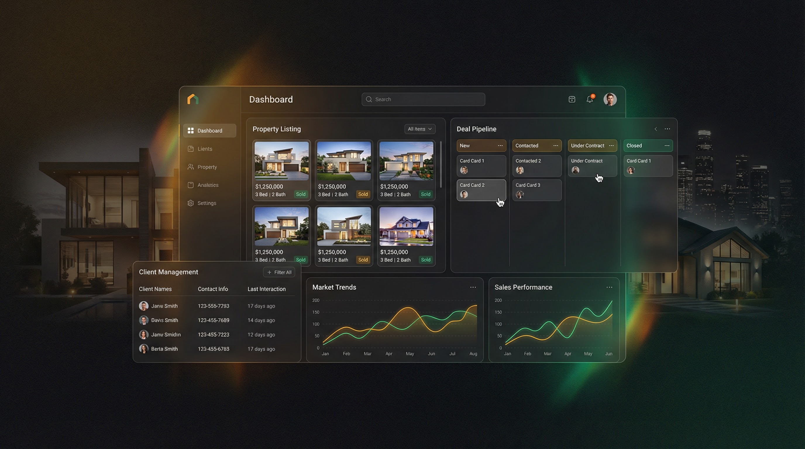

<div align="center">


# Haven Estate Suite

### The CRM Real Estate Agents Actually Want to Use

**MLS integration, deal pipeline, client management, and market analytics, all in one beautiful dashboard. Built for agents who close.**

[](LICENSE)
[](https://www.typescriptlang.org/)
[](https://react.dev/)
[](https://vitejs.dev/)
[](https://supabase.com)
[](https://ui.shadcn.com)

[Features](#features) · [Quick Start](#-quick-start) · [Architecture](#-project-structure) · [Tech Stack](#-technology-stack) · [Docs](#-documentation)

---



</div>

---

## The Problem

Real estate CRMs are either bloated enterprise tools that cost $500/month or basic spreadsheets that fall apart at 50 contacts. Agents need a modern, fast, and affordable platform that handles properties, clients, deals, and analytics without the learning curve.

## The Solution

Haven Estate Suite is a **full-featured real estate CRM** built with modern web technologies. It integrates with MLS for property data, provides a visual deal pipeline, tracks every client interaction, and delivers real-time market analytics, all wrapped in a beautiful, responsive UI with dark mode.

> *Search MLS listings. Drag deals through your pipeline. Track client touchpoints. Generate reports. All from one dashboard.*

---

## Features

- **Property Management**, Comprehensive MLS integration with advanced search, filtering, and property details
- **Client Management**, Track contacts, leads, and client relationships with full interaction history
- **Deal Pipeline**, Visual kanban board to manage deals through customizable stages
- **Activity Timeline**, Complete history of every interaction, showing, and event
- **Analytics Dashboard**, Real-time market insights, sales performance, and trend visualization
- **Report Generation**, Custom reports with data visualizations and export
- **Dark Mode**, Beautiful dark theme with seamless toggle
- **Responsive Design**, Desktop, tablet, and mobile with touch optimization
- **Real-Time Updates**, Live data synchronization across devices via Supabase
- **Row-Level Security**, Database-level security policies protecting every record
- **CI/CD Pipeline**, Automated testing, linting, and deployment via GitHub Actions

## 🚀 Quick Start

### Prerequisites

- Node.js 20+ ([install with nvm](https://github.com/nvm-sh/nvm))
- npm or bun package manager

### Installation

```bash
# Clone the repository
git clone https://github.com/yourusername/haven-estate-suite.git
cd haven-estate-suite

# Install dependencies
npm install

# Start development server
npm run dev
```

The application will be available at `http://localhost:8080`

For detailed setup instructions, see [docs/development/SETUP.md](docs/development/SETUP.md)

## 📁 Project Structure

This project follows the **Feature-Sliced Design** (FSD) architecture pattern:

```
src/
├── app/              # Application initialization and providers
├── pages/            # Route-level pages
├── widgets/          # Complex UI sections (Header, Sidebar, etc.)
├── entities/         # Business entities (Property, Contact, Deal)
├── shared/           # Shared utilities, hooks, and components
│   ├── ui/           # Reusable UI components (Button, Card, etc.)
│   ├── hooks/        # Custom React hooks
│   ├── lib/          # Utility functions
│   └── types/        # TypeScript type definitions
└── integrations/     # External service integrations (Supabase)
```

Learn more about our architecture in [docs/architecture/ARCHITECTURE.md](docs/architecture/ARCHITECTURE.md)

## 🛠️ Technology Stack

### Frontend
- **React 18.3** - UI library with hooks and modern patterns
- **TypeScript 5.6** - Type-safe JavaScript
- **Vite 5** - Fast build tool and dev server
- **Tailwind CSS** - Utility-first CSS framework
- **shadcn/ui** - High-quality component library
- **Radix UI** - Accessible component primitives
- **React Router v6** - Client-side routing
- **TanStack React Query** - Data fetching and caching
- **Recharts** - Data visualization library
- **Lucide React** - Icon library

### Backend
- **Lovable Cloud** - Integrated backend platform
- **PostgreSQL** - Relational database
- **Row Level Security** - Database-level security policies
- **Real-time Subscriptions** - Live data updates
- **Edge Functions** - Serverless backend logic

### Development Tools
- **ESLint** - Code linting
- **Prettier** - Code formatting
- **Vitest** - Fast unit test framework
- **Testing Library** - React component testing
- **GitHub Actions** - CI/CD automation
- **Conventional Commits** - Standardized commit messages

## 📚 Documentation

- [Architecture Overview](docs/architecture/ARCHITECTURE.md)
- [Database Schema](docs/architecture/DATABASE_SCHEMA.md)
- [Feature-Sliced Design](docs/architecture/FEATURE_SLICED_DESIGN.md)
- [Development Setup](docs/development/SETUP.md)
- [Coding Standards](docs/development/CODING_STANDARDS.md)
- [Testing Guidelines](docs/development/TESTING.md)
- [Deployment Guide](docs/deployment/DEPLOYMENT.md)
- [CI/CD Documentation](docs/deployment/CICD.md)

## 🤝 Contributing

We welcome contributions! Please read our [Contributing Guidelines](CONTRIBUTING.md) before submitting pull requests.

### Development Workflow

1. Fork the repository
2. Create a feature branch (`git checkout -b feature/amazing-feature`)
3. Commit your changes (`git commit -m 'feat: add amazing feature'`)
4. Push to the branch (`git push origin feature/amazing-feature`)
5. Open a Pull Request

See [CONTRIBUTING.md](CONTRIBUTING.md) for detailed guidelines.

## 📋 Available Scripts

```bash
# Development
npm run dev              # Start development server
npm run build            # Build for production
npm run preview          # Preview production build

# Testing
npm test                 # Run unit tests
npm run test:ui          # Run tests with UI
npm run test:coverage    # Generate coverage report

# Code Quality
npm run lint             # Run ESLint
npm run lint:fix         # Fix ESLint issues
npm run type-check       # Run TypeScript compiler check
npm run format           # Format code with Prettier
npm run format:check     # Check code formatting

# CI/CD (automated)
npm run build:dev        # Build for development environment
```

## 🚢 Deployment

Haven Estate Suite can be deployed via:

1. **Lovable Platform** (Recommended)
   - One-click deployment
   - Automatic HTTPS
   - Custom domain support
   - See [Deployment Guide](docs/deployment/DEPLOYMENT.md)

2. **Self-Hosted**
   - Build: `npm run build`
   - Deploy `dist/` folder to any static hosting
   - Configure environment variables

## 🔒 Security

We take security seriously. Please read our [Security Policy](SECURITY.md) for:
- Reporting vulnerabilities
- Security best practices
- RLS policy guidelines
- Authentication security

## 📄 License

This project is licensed under the MIT License - see the [LICENSE](LICENSE) file for details.

## 🙏 Acknowledgments

- Built with [Lovable](https://lovable.dev)
- UI components from [shadcn/ui](https://ui.shadcn.com)
- Icons by [Lucide](https://lucide.dev)
- Design system inspired by modern real estate platforms

## 📞 Support

- **Documentation**: [docs/](docs/)
- **Issues**: [GitHub Issues](https://github.com/yourusername/haven-estate-suite/issues)
- **Security**: [SECURITY.md](SECURITY.md)

---

<div align="center">

**Built by [Alex Cinovoj](https://github.com/Alexi5000) · [TechTide AI](https://github.com/Alexi5000)**

*Close more deals. Manage less chaos.*

</div>
